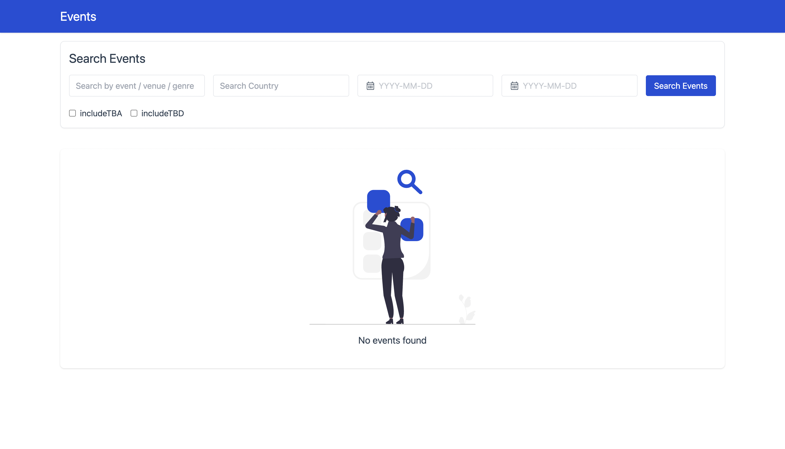
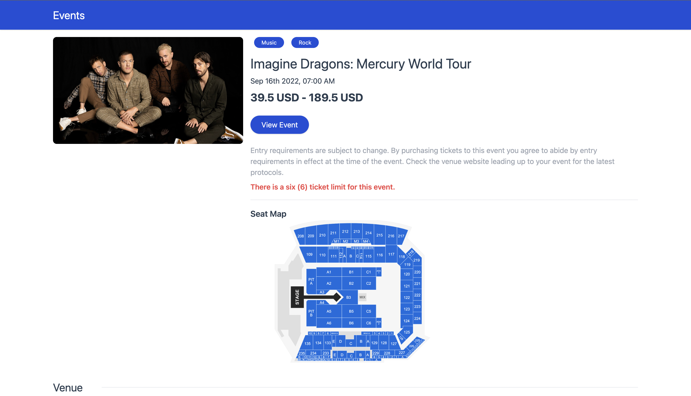
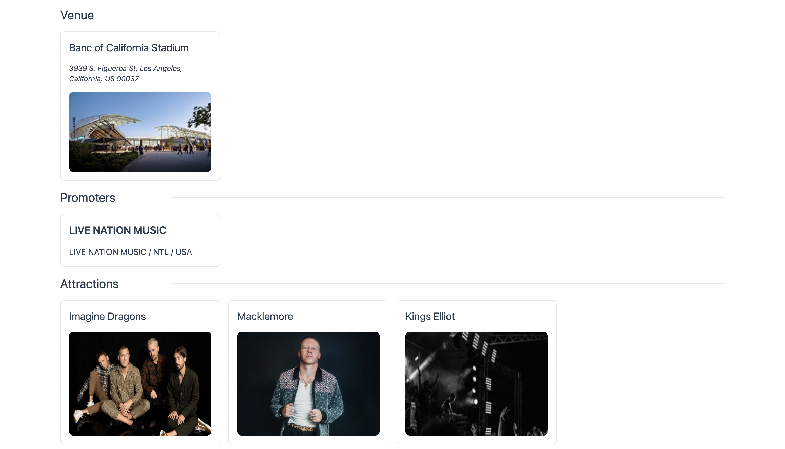

# Event Discovery

An event search application powered by the ticket master event discovery api.

<br/>

## Table of Contents

1. [Local Setup Instructions](#local-setup)
2. [Development server](#development-server)
3. [Application Screenshots](#application-screenshots)

<a name="local-setup"></a>

## Local Setup Instructions

Clone or download this repository to the local file system and update `.env` file with and API key from the ticket master console. (API key can be obtain by registering the following portal https://developer.ticketmaster.com/)

After updating the API Key, install the project dependencies from root folder with the following command

```
npm install
```

<a name="development-server"></a>

## Development server

```
npm run serve
```

<a name="application-screenshots"></a>

## Application Screenshots

<br/>
<br/>
<br/>
<br/>
